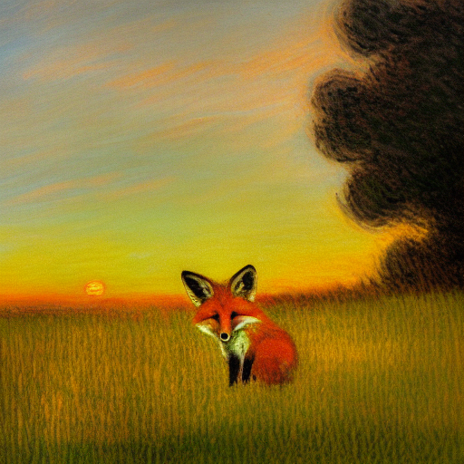

**# Diffusion Model for Text and Image Translation**

**## Description**

This repository houses a large-scale diffusion model implemented in PyTorch, capable of generating visually stunning images from text descriptions and performing image-to-image translation tasks.

**## Key Features**

* **Versatile:** Handles both text-to-image and image-to-image translation.
* **Expressive:** Generates high-quality, creative images that align with prompts.
* **Technically Proficient:** Built from scratch using advanced deep learning techniques:
  * Latent diffusion architecture for image generation
  * Pre-trained CLIP model for text embedding
  * Attention-based U-Net for spatial feature extraction
  * VAE for latent representation learning
* **1.066 Billion Parameters:** Demonstrates expertise in handling large-scale models.

**## Inference**

* Explore the model's capabilities using the `demo.ipynb` notebook.

**## Examples**

[Insert a captivating image generated from a text prompt]

**Prompt:** a painting of a fox sitting in a field at sunrise in the style of Claude Monet, higly detailed, ultra sharp, 8k resolution.

**## Setup**

1. Clone this repository: `git clone https://github.com/Ishan25j/Diffusion-Implementation`
2. Navigate to the `sd` directory: `cd Diffusion-Implementation/sd`
3. Install required libraries: `pip install -r requirements.txt`

**## Usage**

* Refer to the `demo.ipynb` notebook for detailed instructions on using the model for text-to-image and image-to-image translation.

**## Contributions**

Bug fixes and improvements are welcome! Please follow standard GitHub procedures for contributing.
